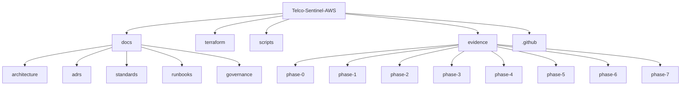

# Telco-Sentinel-AWS

Enterprise-style AWS architecture project for a telecommunications scenario, designed to demonstrate cloud governance, security posture, observability, data foundations, and delivery controls using Terraform, GitHub Actions, and evidence-based execution.

## Objectives

- Establish a governed AWS baseline for a telecom operations platform
- Implement phase-based evidence and validation procedures
- Document standards, ADRs, and operational decisions
- Prepare the repository for secure network, observability, and analytics phases

## Phase Model

- Phase 0 — Project Control Plane
- Phase 1 — Governance & Standards
- Phase 2 — Secure Network Baseline
- Phase 3 — Audit & Security Posture
- Phase 4 — Real-Time Telco Observability
- Phase 5 — Operational Data Lake
- Phase 6 — Delivery Controls & CI/CD
- Phase 7 — Executive Closure & Roadmap

## Repository Control Plane

