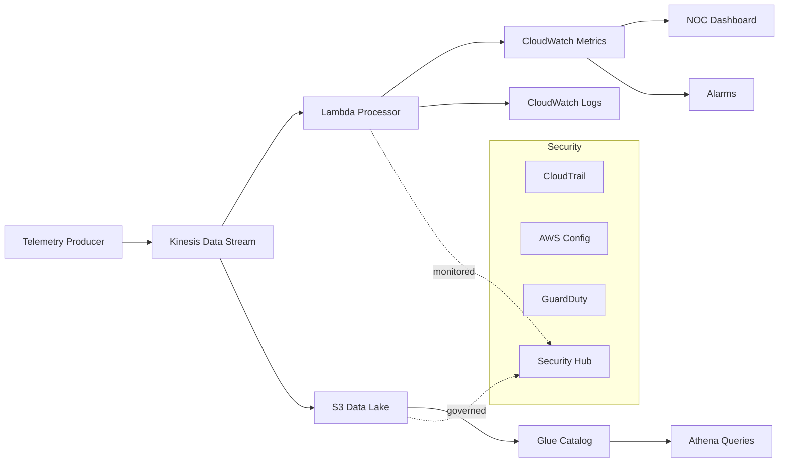

# Telco-Sentinel-AWS

## Enterprise Cloud Platform for Telco Observability, Security & FinOps

---

## Executive Summary

Telco-Sentinel-AWS is an enterprise-grade cloud architecture project that demonstrates how to design, implement, and operate a governed telecommunications platform on AWS.

The platform integrates:

- secure cloud foundation
- real-time network observability
- centralized audit & security posture
- operational data lake
- controlled infrastructure delivery (CI/CD)
- FinOps governance

The objective is not to deploy infrastructure —
it is to demonstrate **control, traceability, and decision-making under real-world constraints**.

---

## Business Context

Telecommunications providers operate under:

- high-volume telemetry streams
- strict SLA requirements
- regulatory pressure
- cost sensitivity at scale
- operational complexity (NOC, incidents, network events)

Typical challenges:

- fragmented observability
- limited traceability of changes
- lack of cost visibility
- weak governance models
- reactive operations

This project addresses those gaps through a **cloud-native, governed architecture**.

---

## What This Project Demonstrates

This repository is designed to reflect **senior-level architecture capabilities**:

### Governance

- tagging standards
- naming conventions
- control matrix
- risk register

### Security & Audit

- CloudTrail
- AWS Config
- GuardDuty
- Security Hub

### Observability (Telco-focused)

- real-time telemetry ingestion
- event processing (Kinesis + Lambda)
- NOC dashboards
- alerting model

### Data Platform

- S3-based data lake (raw / curated)
- Glue catalog
- Athena analytics

### Delivery Controls

- Terraform IaC
- GitHub Actions CI pipeline
- plan-based delivery model
- manual apply governance

### FinOps

- cost allocation tags
- AWS Budgets
- cost model
- KPI framework

---

## Architecture Overview

### Logical Architecture



---

## Architecture Principles

* **Control over convenience**
* **Observability by design**
* **Security as baseline, not add-on**
* **Infrastructure as code (no manual drift)**
* **Cost awareness from day one**
* **Evidence-driven delivery**

---

## Phase-Based Execution Model (Sentinel Method)

The project is structured in controlled phases:

| Phase | Name                     | Focus                          |
| ----- | ------------------------ | ------------------------------ |
| 0     | Project Control Plane    | structure, standards, evidence |
| 1     | Governance & Standards   | tagging, naming, risk          |
| 2     | Secure Network Baseline  | VPC, subnets, routing          |
| 3     | Audit & Security Posture | CloudTrail, Config, GuardDuty  |
| 4     | Telco Observability      | streaming + metrics            |
| 5     | Operational Data Lake    | S3, Glue, Athena               |
| 6     | Delivery Controls        | CI/CD, validation              |
| 7     | FinOps                   | budgets, cost visibility       |

Each phase includes:

* Terraform execution
* screenshots
* CLI outputs
* validation checklist
* technical notes

---

## Evidence Model

Every phase produces verifiable artifacts:

```text
evidence/
└─ phase-X/
   ├─ screenshots/
   ├─ txt/
   ├─ notes/
   └─ validation-checklist.md
```

This ensures:

* reproducibility
* auditability
* interview-ready proof

---

## Security Model

Baseline controls include:

* centralized audit logging (CloudTrail)
* configuration tracking (AWS Config)
* threat detection (GuardDuty)
* posture management (Security Hub)
* encryption via KMS
* least privilege design (conceptual)

---

## Observability Model (Telco)

### MVP

* Kinesis Data Streams
* Lambda processing
* CloudWatch metrics & logs

### Enterprise Target

* Amazon MSK (Kafka)
* multi-consumer streaming
* OpenSearch integration
* advanced SLA monitoring

---

## Data Strategy

* S3 as data lake (raw / curated)
* partitioned datasets
* Glue catalog for metadata
* Athena for analytics

Focus:

* scalability
* cost efficiency
* operational analytics

---

## Delivery Model

* Terraform as single source of truth
* GitHub Actions for validation
* plan artifact review before apply
* manual deployment control (gated)

---

## FinOps Model

* mandatory tagging for cost allocation
* AWS Budgets with alerting
* cost estimation per component
* KPI-based cost visibility

---

## Key Metrics

### Technical

* infrastructure reproducibility
* telemetry throughput
* pipeline success rate

### Security

* % resources monitored
* findings baseline
* encryption coverage

### FinOps

* budget adherence
* cost per component
* tag compliance rate

---

## Trade-offs

| Decision                     | Trade-off                           |
| ---------------------------- | ----------------------------------- |
| Kinesis over MSK             | simpler, less scalable              |
| single account               | faster MVP, less isolation          |
| manual apply                 | slower, more controlled             |
| CloudWatch vs external tools | lower complexity, limited analytics |

---

## Risks

* underestimation of streaming scale
* lack of multi-account isolation
* cost growth without enforcement
* operational complexity as features expand

---

## Roadmap

### Now

* full baseline (network, security, observability, CI/CD, FinOps)

### Next

* multi-account architecture
* centralized logging account
* advanced monitoring (EventBridge)

### Later

* MSK (Kafka)
* OpenSearch analytics
* incident management integration
* TM Forum alignment

---

## Conclusion

Telco-Sentinel-AWS is not a demo.

It is a **controlled architecture exercise** that demonstrates:

* governance discipline
* operational thinking
* security awareness
* cost accountability
* structured delivery

This project reflects how a cloud platform should be **designed, validated, and evolved** in a real enterprise telecommunications environment.

---

## Author

Fernando Cuellar
Cloud Solutions Architect | FinOps | Multicloud (AWS / OCI)

---
