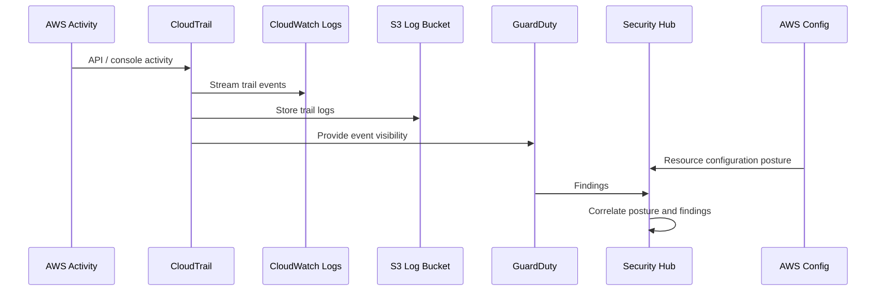

# Audit Flow

```mermaid
sequenceDiagram
    participant User as AWS Activity
    participant CT as CloudTrail
    participant CW as CloudWatch Logs
    participant S3 as S3 Log Bucket
    participant GD as GuardDuty
    participant SH as Security Hub
    participant CFG as AWS Config

    User->>CT: API / console activity
    CT->>CW: Stream trail events
    CT->>S3: Store trail logs
    CT->>GD: Provide event visibility
    CFG->>SH: Resource configuration posture
    GD->>SH: Findings
    SH->>SH: Correlate posture and findings
```
