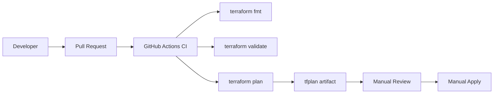

# Delivery Pipeline Architecture

## Objective

Provide a controlled and auditable CI/CD pipeline for Terraform-based infrastructure delivery.

## Components

- GitHub repository
- GitHub Actions workflow
- Terraform CLI
- AWS environment
- Artifact storage for tfplan

## Diagram

