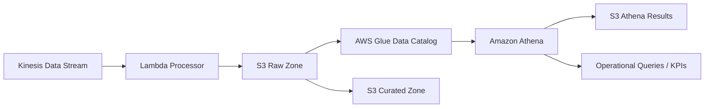

# Operational Data Lake

## Objective

Store, catalog, and query telecommunications telemetry data for historical operations analysis.

## Core Components

- Amazon S3 raw zone
- Amazon S3 curated zone
- AWS Glue Data Catalog
- Amazon Athena
- S3 Athena query results bucket

## Diagram

