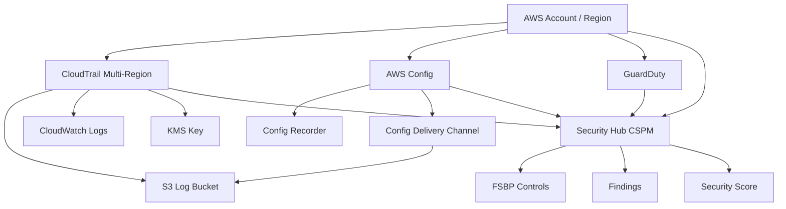

# Security Posture Architecture

## Objective

Define the baseline audit and security posture services for Telco-Sentinel-AWS.

## Services Included

- AWS CloudTrail
- AWS Config
- AWS KMS
- Amazon S3 for security logs
- Amazon CloudWatch Logs
- Amazon GuardDuty
- AWS Security Hub CSPM
- AWS Foundational Security Best Practices standard

## Diagram

