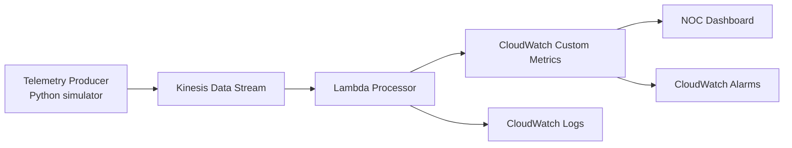

# Telco Observability Architecture

## Objective

Provide a real-time observability baseline for simulated telecommunications telemetry.

## MVP Pattern

- Telemetry producer in Python
- Amazon Kinesis Data Stream
- AWS Lambda processor
- CloudWatch Logs
- CloudWatch custom metrics
- CloudWatch NOC dashboard
- CloudWatch alarms

## Diagram

