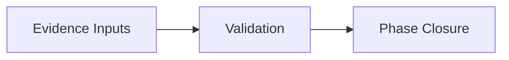

# Mermaid Guidelines

## Why Mermaid

Use text-based diagrams to keep architecture documentation versionable and maintainable.

## Approved Diagram Types

- flowchart
- sequenceDiagram
- stateDiagram-v2
- classDiagram
- erDiagram

## Rules

- keep labels short
- do not overload one diagram
- one purpose per diagram
- store complex diagrams in docs/architecture

## Example

